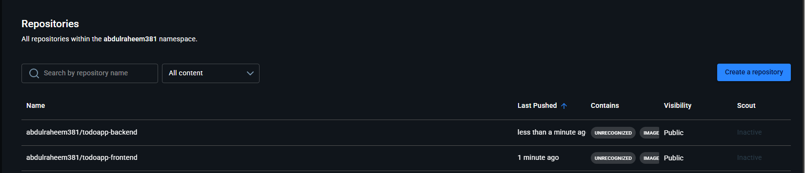
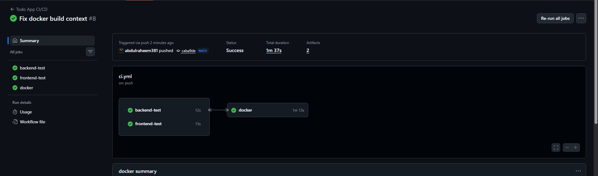
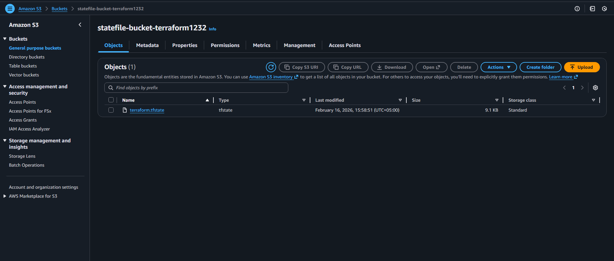
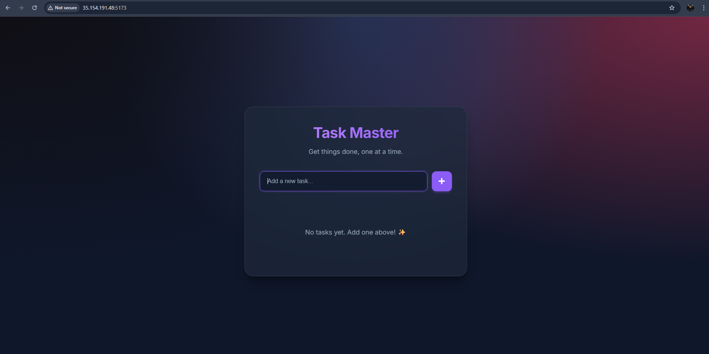

# Todo App with Full DevOps Lifecycle

## Project Overview

This project demonstrates a complete DevOps implementation, transforming a simple Todo application into a fully containerized, tested, and deployed solution on AWS.

The project evolved through the following stages:

1.  **Simple Todo App**: Started with a basic Python Flask backend and a React frontend.
2.  **Containerization**: Dockerized the application using Docker and Docker Compose to ensure consistency across environments.
3.  **CI Pipeline**: Implemented a CI/CD pipeline using **GitHub Actions** that automatically:
    *   Runs linting (`flake8`, `eslint`) and tests (`pytest`, `vitest`).
    *   Builds Docker images for both services.
    *   Pushes the verified images to DockerHub.
4.  **Infrastructure as Code (IaC)**: Used **Terraform** to provision an AWS EC2 instance.
5.  **Deployment**: Deployed the application on the provisioned EC2 server, completing the full DevOps loop.

## Architecture & Screenshots

Below are screenshots demonstrating various stages of the project (application, pipeline, infrastructure):






## Tech Stack

*   **Frontend**: React (Vite)
*   **Backend**: Python (Flask)
*   **Database**: SQLite (embedded)
*   **Containerization**: Docker, Docker Compose
*   **CI/CD**: GitHub Actions
*   **Infrastructure**: Terraform, AWS (EC2)

---

## Setup & Run

### Method 1: Run with Docker (Recommended)

To run the entire application stack using Docker Compose:

1.  Make sure you have Docker and Docker Compose installed.
2.  Run the following command in the root directory:
    ```bash
    docker-compose up --build
    ```
3.  Access the application:
    *   Frontend: `http://localhost:5173`
    *   Backend API: `http://localhost:5000`

### Method 2: Run with Terraform (Infrastructure)

To provision the infrastructure on AWS:

1.  Navigate to the `Terraform` directory:
    ```bash
    cd Terraform
    ```
2.  Initialize Terraform:
    ```bash
    terraform init
    ```
3.  Plan and Apply the configuration:
    ```bash
    terraform plan
    terraform apply
    ```

### Method 3: Run Locally (Development)

#### Backend
1.  Navigate to `backend/`:
    ```bash
    cd backend
    ```
2.  Install dependencies:
    ```bash
    pip install -r requirements.txt
    ```
3.  Run the server:
    ```bash
    python app.py
    ```

#### Frontend
1.  Navigate to `frontend/`:
    ```bash
    cd frontend
    ```
2.  Install dependencies:
    ```bash
    npm install
    ```
3.  Run the development server:
    ```bash
    npm run dev
    ```

## Features

*   Create, Read, Update, Delete (CRUD) Todos.
*   Data persisted in SQLite (`backend/todo.db`).
*   Modern dark/light mode React UI.
*   Fully automated CI/CD pipeline.
